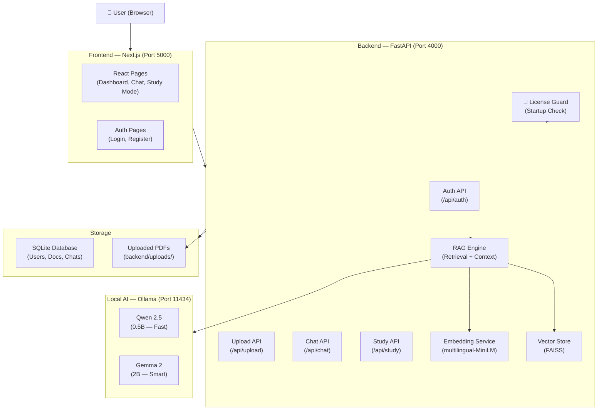

<div align="center">

# 🎓 AuraQA
### AI-Powered Academic Document Assistant

*A fully offline, privacy-preserving RAG system for academic document Q&A*

[](https://python.org)
[](https://fastapi.tiangolo.com)
[](https://nextjs.org)
[](https://ollama.com)
[](https://sqlite.org)
[](LICENSE)

---

**AuraQA** is a fully offline, license-protected AI document assistant built for academic use.  
Upload your research papers, thesis chapters, or lecture notes — then **chat with them, generate summaries, quizzes, and flashcards** using locally running AI models. No internet required. No data leaves your machine.

</div>

---

## ✨ Features

| Feature | Description |
|---|---|
| 💬 **Document Chat (RAG)** | Ask questions directly about your uploaded PDF documents using Retrieval-Augmented Generation |
| 📚 **Study Mode** | Auto-generates document summaries, key concepts, study conclusions, and chapter breakdowns |
| 🃏 **Flashcard Generator** | Creates interactive flip-card flashcards from your document content |
| 📝 **Quiz Generator** | Generates MCQ, True/False, and short-answer quizzes from document content |
| 🌍 **Multilingual Support** | Supports English, French, Arabic, Spanish, German, and Hausa |
| 🔒 **License Protection** | Hardware-bound key system — system cannot run without an activation key |
| 🛡️ **Security Hardened** | Rate limiting, CORS lockdown, account lockout, prompt injection guard |
| 📴 **Fully Offline** | All AI inference runs locally via Ollama — zero external API calls |
| 🌙 **Dark & Light Mode** | Full theme support across all pages |
| 🔐 **JWT Authentication** | Secure user registration, login, and session management |

---

## 🧠 AI Models

AuraQA uses two locally running AI models via **Ollama**:

| Model | Size | Mode | Best For |
|---|---|---|---|
| **Qwen 2.5 (0.5B)** | 397 MB | ⚡ Fast Mode | Quick answers, daily use |
| **Gemma 2 (2B)** | 1.6 GB | 🧠 Smart Mode | Deep reasoning, complex questions |

Both models run **100% on your machine** — no API keys, no internet, no subscriptions.

---

## 🏗️ System Architecture



---

## 🛠️ Tech Stack

### Backend
- **FastAPI** — High-performance Python REST API framework
- **SQLAlchemy** — ORM for database management
- **SQLite** — Lightweight local database
- **PyPDF2 / pdfplumber** — PDF text extraction
- **sentence-transformers** — Multilingual text embeddings (`paraphrase-multilingual-MiniLM-L12-v2`)
- **FAISS** — Fast vector similarity search for RAG
- **python-jose** — JWT authentication
- **bcrypt** — Password hashing

### Frontend
- **Next.js 16** — React framework with App Router
- **TypeScript** — Type-safe development
- **Tailwind CSS v4** — Utility-first styling
- **Lucide React** — Icon library

### AI & Inference
- **Ollama** — Local LLM inference server
- **Qwen 2.5 (0.5B)** — Fast mode model
- **Gemma 2 (2B)** — Smart mode model

---

## 📋 Prerequisites

Before installing, make sure you have:

- ✅ **Python 3.10+** — [Download](https://python.org/downloads)
- ✅ **Node.js 18+** — [Download](https://nodejs.org)
- ✅ **Ollama** — [Download](https://ollama.com/download)
- ✅ **Git** — [Download](https://git-scm.com)
- ✅ **An activation key** — Contact the system owner

---

## 🚀 Installation Guide

### Step 1 — Clone the Repository
```bash
git clone https://github.com/SageerAuwal/AuraQA.git
cd AuraQA
```

### Step 2 — Set Up Python Virtual Environment
```bash
python -m venv venv

# Windows
venv\Scripts\activate

# macOS/Linux
source venv/bin/activate
```

### Step 3 — Install Backend Dependencies
```bash
cd backend
pip install -r requirements.txt
cd ..
```

### Step 4 — Install Frontend Dependencies
```bash
cd frontend
npm install
cd ..
```

### Step 5 — Download AI Models
```bash
ollama pull qwen2.5:0.5b
ollama pull gemma2:2b
```

### Step 6 — Activate the License
You must have a valid **MASTER_KEY** from the system owner.

```bash
cd backend
python generate_license.py
```

When prompted, enter your MASTER_KEY. This will:
- Generate a hardware-bound `.license` file for your machine
- Create the required `.env` file automatically

> ⚠️ **Without a valid MASTER_KEY, the system will not start.**

---

## ▶️ Running the System

### Option 1 — Using the Batch Files (Windows, Recommended)

**Start all services:**
```
Double-click run_servers.bat
```

**Stop all services:**
```
Double-click stop_servers.bat
```

### Option 2 — Manual Start

**Terminal 1 — Ollama:**
```bash
ollama serve
```

**Terminal 2 — Backend:**
```bash
cd backend
..\venv\Scripts\python.exe -m uvicorn app.main:app --host 127.0.0.1 --port 4000
```

**Terminal 3 — Frontend:**
```bash
cd frontend
npm run build
npm run start
```

### Access the Application
Open your browser and go to: **http://localhost:5000**

---

## 🔐 License Protection System

AuraQA is protected by a **two-layer hardware-bound license system**:

1. **MASTER_KEY** — A secret passphrase provided by the system owner. Stored in `backend/.env`.
2. **Hardware Fingerprint** — A `.license` file generated specifically for your machine (MAC address + hostname + architecture). Works only on the machine it was generated on.

### What Happens Without a Key
When someone tries to run the system without a valid key:
```
══════════════════════════════════════════
  AuraQA — ACCESS DENIED
  Reason: MASTER_KEY is missing from .env file.
══════════════════════════════════════════
```

The server exits immediately. No access is granted.

### Getting Access
Contact the system owner to receive a **MASTER_KEY**, then follow **Step 6** of the installation guide above.

> **Note:** The `.env` file, `.license` file, and all keys are excluded from this repository via `.gitignore`. They are never published to GitHub.

---

## 🛡️ Security Features

| Feature | Implementation |
|---|---|
| Hardware-bound licensing | Machine fingerprint + HMAC-SHA256 signature |
| API documentation hidden | `/docs` and `/redoc` endpoints disabled |
| CORS restricted | Only `localhost:5000` allowed |
| Account lockout | 5 failed logins → 15-minute lock |
| Prompt injection guard | Banned phrase filter + system prompt enforcer |
| Security response headers | X-Frame-Options, X-XSS-Protection, nosniff |
| JWT authentication | HS256 signed tokens, 60-minute expiry |
| Password hashing | bcrypt with salt |
| Offline AI inference | No external API calls ever made |

---

## 🌍 Supported Languages

| Language | Code | Status |
|---|---|---|
| English | `en` | ✅ Full support |
| French | `fr` | ✅ Full support |
| Arabic | `ar` | ✅ Full support |
| Spanish | `es` | ✅ Full support |
| German | `de` | ✅ Full support |
| Hausa | `ha` | ✅ Supported (embedding level) |

---

## 📁 Project Structure

```
AuraQA/
├── backend/                    # FastAPI backend
│   ├── app/
│   │   ├── api/endpoints/      # Route handlers (auth, chat, study, upload...)
│   │   ├── core/               # Config, database, security
│   │   ├── models/             # SQLAlchemy ORM models
│   │   ├── schemas/            # Pydantic validation schemas
│   │   ├── security/           # License check module
│   │   └── services/           # Business logic (RAG, embedding, LLM...)
│   ├── generate_license.py     # One-time license setup script
│   ├── setup_license.py        # License creation from provided key
│   ├── key_prompt.py           # GUI popup for key entry
│   └── requirements.txt        # Python dependencies
│
├── frontend/                   # Next.js frontend
│   └── src/app/
│       ├── dashboard/          # Main dashboard, study mode, document pages
│       ├── chat/               # Chat interface
│       └── globals.css         # Global styles + theme system
│
├── run_servers.bat             # Start all services (with license check)
├── stop_servers.bat            # Stop all services cleanly
└── README.md                   # This file
```

---

## 👤 Author

**Sageer Auwal**  
Federal University of Kashef, Gombe State  
Faculty of Science and Computer Science  

📧 Contact the author for access keys and support.

---

## 📄 License

This project is **proprietary software**. All rights reserved.

- ❌ You may **not** use, copy, modify, or distribute this software without explicit written permission from the author.
- ❌ You may **not** run this software without a valid activation key issued by the author.
- ✅ You may **view** the source code for educational reference only.

© 2026 Sageer Auwal. All rights reserved.

---

<div align="center">

**Built with ❤️ for academic excellence**  
*AuraQA — Learn Smarter, Not Harder*

</div>
